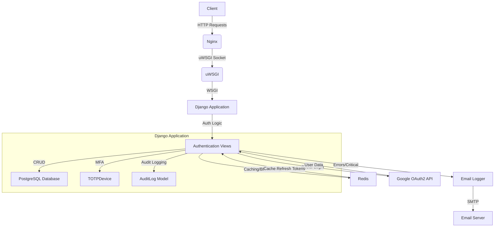

# Auth Service Microservice

This microservice handles identity and authentication for a SaaS platform with multi-tenancy, Role-Based Access Control (RBAC), Multi-Factor Authentication (MFA), and social login support. It is built using Django, Django REST Framework, and deployed with uWSGI and Nginx.

## Features
- **User Authentication**: Signup, login, token refresh, and social login (Google OAuth2).
- **Multi-Tenancy**: Tenant-specific subdomains (e.g., `company1.humanadv.com`) with subscription tiers (HumanLite, HumanAdv, HumanPro).
- **RBAC**: Role assignment restricted to HumanAdv/Pro tiers, enforced via tenant tier checks.
- **MFA**: TOTP-based MFA with QR code generation and verification.
- **Audit Logging**: Tracks user actions (signup, login, role assignment, etc.).
- **Custom Logging**: Emails sent for ERROR and CRITICAL events.
- **Scalability**: Redis caching and blacklisting, rate limiting (100 requests/hour/user).

## Tech Stack
- **Backend**: Django 4.x, Django REST Framework
- **Database**: PostgreSQL
- **Caching/Blacklisting**: Redis
- **Deployment**: uWSGI + Nginx
- **Dependencies**: `social-auth-app-django`, `qrcode`, `pillow`, `redis`

## Microservice Architecture



## Setup Instructions

### Prerequisites
- Python 3.10+
- PostgreSQL
- Redis
- Nginx
- uWSGI

### Installation
1. **Clone Repository**:
   ```bash
   git clone <repo-url>
   cd auth_service
   ```

2. **Install Dependencies**:
   ```bash
   pip install -r requirements.txt
   ```

3. **Configure Environment**:
   Create a `.env` file:
   ```
    SECRET_KEY=your-secret-key-here
    DEBUG=False
    DB_USER=postgres
    DB_PASSWORD=Admin
    DB_PORT=5432
    DB_NAME=auth_db
    DB_HOST=localhost
    JWT_SECRET=your-jwt-secret-here
    SOCIAL_AUTH_GOOGLE_OAUTH2_KEY=your-google-client-id
    SOCIAL_AUTH_GOOGLE_OAUTH2_SECRET=your-google-client-secret
    EMAIL_BACKEND = 'django.core.mail.backends.smtp.EmailBackend'
    EMAIL_HOST = 'smtp.gmail.com'
    EMAIL_PORT = 587
    EMAIL_USE_TLS = True
    EMAIL_HOST_USER = 'your-email@gmail.com'
    EMAIL_HOST_PASSWORD = 'your-app-password'
    RECIPIENT_LIST = 'techsupport@einstellen.ai'
    REDIS_HOST=localhost
    REDIS_PORT=6379
   ```

4. **Run Migrations**:
   ```bash
   python manage.py makemigrations
   python manage.py migrate
   ```

5. **Create Initial Tenants**:
   ```python
   # python manage.py shell
   from authentication.models import Tenant, Subscription
   tenant = Tenant.objects.create(name="company1", subdomain="company1", tier="humanadv")
   Subscription.objects.create(tenant=tenant, is_active=True)
   tenant = Tenant.objects.create(name="lite", subdomain="humanlite", tier="humanlite")
   Subscription.objects.create(tenant=tenant, is_active=True)
   ```

### Running Locally
```bash
python manage.py runserver
```

### Deployment with uWSGI + Nginx
1. **Collect Static Files**:
   ```bash
   python manage.py collectstatic
   ```

2. **Start uWSGI**:
   ```bash
   uwsgi --ini uwsgi.ini
   ```

3. **Configure Nginx**:
   - Copy `nginx.conf` to `/etc/nginx/sites-available/auth_service`.
   - Link it: `sudo ln -s /etc/nginx/sites-available/auth_service /etc/nginx/sites-enabled/`.
   - Test: `sudo nginx -t`.
   - Restart: `sudo systemctl restart nginx`.

4. **Test**:
   - Use Postman with `http://humanlite.com` or `http://company1.humanadv.com`.

## Configuration Files

### `uwsgi.ini`
```ini
[uwsgi]
module = config.wsgi:application
master = true
processes = 4
threads = 2
socket = /tmp/auth_service.sock
chmod-socket = 666
vacuum = true
env = DJANGO_SETTINGS_MODULE=config.settings
http-timeout = 60
harakiri = 60
pidfile = /tmp/auth_service.pid
daemonize = /var/log/uwsgi/auth_service.log
```

### Nginx Config
```nginx
server {
    listen 80;
    server_name domain *.domain ;

    location / {
        include uwsgi_params;
        uwsgi_pass unix:/tmp/auth_service.sock;
    }

    location /static/ {
        alias /path/to/auth_service/static/;
    }
}
```

## Testing
- **Postman Collection**: Import the provided JSON collection to test all endpoints.
- **Scenarios**:
  - Signup/Login for HumanLite (`humanlite.com`) and HumanAdv (`company1.humanadv.com`).
  - Role assignment (should fail in HumanLite).
  - MFA setup and verification.
  - Social login with Google OAuth2.
  - Token refresh and blacklisting.

## Logging
- **Console**: Debug in development, Info in production.
- **Email**: Sent for ERROR and CRITICAL events to `admin@example.com`.

## Scaling
- Increase `processes` and `threads` in `uwsgi.ini` based on load.
- Use a Redis cluster for high availability.
- Deploy PostgreSQL on a separate instance with replication.

## Next Steps
- Integrate with other microservices (e.g., job postings).
- Add monitoring (e.g., Sentry).
- Implement tenant onboarding API.
